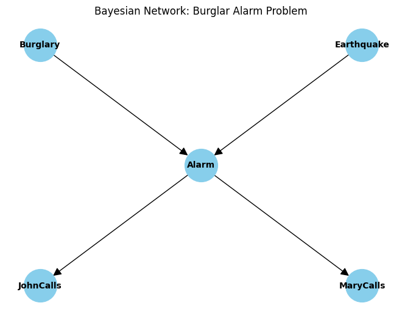
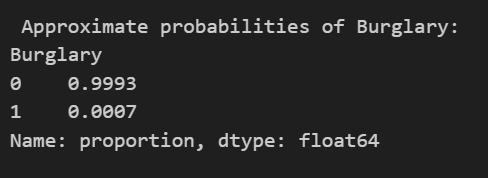

<H3>NAME : KAVINRAJA D</H3>
<H3>REGISTER NO. : 212222240047</H3>
<H3>EX. NO.3</H3>
<H3>DATE: </H3>
<H1 ALIGN =CENTER> Implementation of Approximate Inference in Bayesian Networks
</H1>

## Aim: 
   To construct a python program to implement approximate inference using Gibbs Sampling.</br>
## Algorithm:
   Step 1: Bayesian Network Definition and CPDs:<br>
    <ul> <li>Define the Bayesian network structure using the BayesianNetwork class from pgmpy.models.</li>
    <li>Define Conditional Probability Distributions (CPDs) for each variable using the TabularCPD class.</li>
    <li>Add the CPDs to the network.</li></ul>
    Step 2: Printing Bayesian Network Structure:<br>
    <ul><li>Print the structure of the Bayesian network using the print(network) statement.</li></ul>
   Step 3: Graph Visualization:
    <ul><li>Import the necessary libraries (networkx and matplotlib).</li>
    <li>Create a directed graph using networkx.DiGraph().</li>
    <li>Define the nodes and edges of the graph.</li>
    <li>Add nodes and edges to the graph.</li>
    <li>Optionally, define positions for the nodes.</li>
    <li>Use nx.draw() to visualize the graph using matplotlib.</li></ul>
    Step 4: Gibbs Sampling and MCMC:<br>
    <ul><li>Initialize Gibbs Sampling for MCMC using the GibbsSampling class and provide the Bayesian network.</li>
    <li>Set the number of samples to be generated using num_samples.</li></ul>
    Step 5: Perform MCMC Sampling:<br>
    <ul><li>Use the sample() method of the GibbsSampling instance to perform MCMC sampling.</li>
    <li>Store the generated samples in the samples variable.</li></ul>
    Step 6: Approximate Probability Calculation:<br>
    <ul><li>Specify the variable for which you want to calculate the approximate probabilities (query_variable).</li>
    <li>Use .value_counts(normalize=True) on the samples of the query_variable to calculate approximate probabilities.</li></ul>
    Step 7:Print Approximate Probabilities:<br>
    <ul><li>Print the calculated approximate probabilities for the specified query_variable.</li></ul>


## Program:
```py
#importing required libraries

from pgmpy.models import BayesianNetwork
from pgmpy.factors.discrete import TabularCPD
from pgmpy.sampling import GibbsSampling
import networkx as nx
import matplotlib.pyplot as plt

#define bayesian network structure
network=BayesianNetwork([
    ('Burglary','Alarm'),
    ('Earthquake','Alarm'),
    ('Alarm','JohnCalls'),
    ('Alarm','MaryCalls')
])

#define the conditional probability distributions

cpd_burglary = TabularCPD(variable='Burglary',variable_card=2,values=[[0.999],[0.001]])
cpd_earthquake = TabularCPD(variable='Earthquake',variable_card=2,values=[[0.998],[0.002]])
cpd_alarm = TabularCPD(variable ='Alarm',variable_card=2, values=[[0.999, 0.71, 0.06, 0.05],[0.001, 0.29, 0.94, 0.95]],evidence=['Burglary','Earthquake'],evidence_card=[2,2])
cpd_john_calls = TabularCPD(variable='JohnCalls',variable_card=2,values=[[0.95,0.1],[0.05,0.9]],evidence=['Alarm'],evidence_card=[2])
cpd_mary_calls = TabularCPD(variable='MaryCalls',variable_card=2,values=[[0.99,0.3],[0.01,0.7]],evidence=['Alarm'],evidence_card=[2])

#Add CPDs to the network
network.add_cpds(cpd_burglary,cpd_earthquake,cpd_alarm,cpd_john_calls,cpd_mary_calls)

#Print the Bayesian network structure

print("Bayesian Network Structure :")
print(network)

#create a directed graph
G = nx.DiGraph()

# Define nodes and edges

nodes=['Burglary','Earthquake','Alarm','JohnCalls','MaryCalls']
edges=[('Burglary','Alarm'),('Earthquake','Alarm'),('Alarm','JohnCalls'),('Alarm','MaryCalls')]

#Add nodes and edges to the graph

G.add_nodes_from(nodes)
G.add_edges_from(edges)

#Set positions for nodes(optional)
pos ={
    'Burglary':(0,0),
    'Earthquake':(2,0),
    'Alarm':(1,-2),
    'JohnCalls':(0,-4),
    'MaryCalls':(2,-4)
}

#Draw the graph

nx.draw(G,pos,with_labels=True,node_size=1500,node_color='grey',font_size=10,font_weight='bold',arrowsize=20)
plt.title("Bayesian Network: Alarm Problem")
plt.show()

#Initialize Gibbs sampling for MCMC
gibbs_sampler =GibbsSampling(network)

#Set the number of samples
num_samples=10000

#perform MCMC sampling
samples=gibbs_sampler.sample(size=num_samples)

#Calculate approximate probabilities based on the samples

query_variable='Burglary'
query_result= samples[query_variable].value_counts(normalize=True)

# print the approximate probabilities
print("\n Approximate Probabilities of {}".format(query_variable))
print(query_result)

```


## Output:






## Result:
Thus, Gibb's Sampling( Approximate Inference method) is succuessfully implemented using python.
